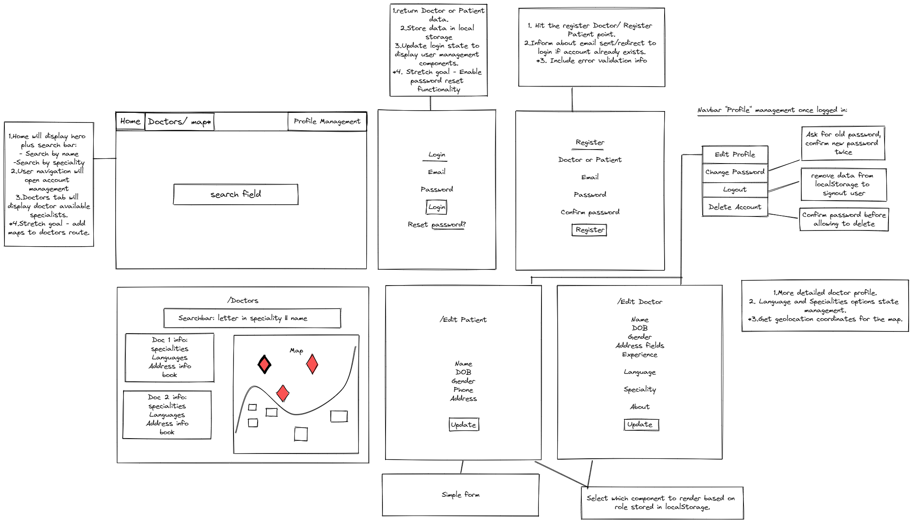

#  GA London SEI Project-3-findMeADoc

## TABLE OF CONTENTS

- [Overview](#overview)
  - [Brief](#brief)
  - [Technologies Used](#technologies)
  - [Installation](#installation)
  - [Demo](#demo)
- [Development](#development)
  - [Planning](#planning)
  - [Login / Register](#login-register)
  - [Profile Management](#profile-management)
  - [Doctors](#doctors)
  - [Map](#map)
  - [Reviews](#reviews)
  - [Styling](#styling)
- [Difficulties and Wins](#difficulties-wins)
  - [Known Bugs](#bugs)
  - [Challenges and Wins](#challenges-wins)
- [Future Improvements](#future-improvements)
- [Key Learnings](#key-learnings)

## <a name='overview'>Overview</a>

**To view deployed project please click [here](https://findmedoc.netlify.app/).**

The third project on General Assembly's Software Engineering Immersive bootcamp was to build a full-stack MERN application with Node, Express and Mongo for the backend and ReactJS for the frontend.

We were choosing between a Discord clone, an e-commerce site or a therapy platform to connect patients to doctors. After a brief discussion, all of us agreed that the latest project would allow us to challenge ourselves and work with interesting technologies.

We were inspired by a [findoc platform](https://www.findoc.co.uk/) and have aimed to recreate a clone similar to this platform.

We were able to make the MVP and went above and beyond to implement most of our stretch goals, but unfortunately had to pass on image upload due to some unexpected deployment issues towards the end of the project.

Project duration: 2 weeks as part of the part-time course.

Team consisted of: Julie Park, Taher Khatieb, Zan Makarov.

### <a name='brief'>Brief</a>

- Make a group project in pre-assigned groups of 3.
- Build a full-stack application by making your own backend and your own frontend.
- Use an Express API to serve data from a Mongo database.
- Consume your API with a front-end built with React.
- Make a complete product using multiple relationships and CRUD functionality for some models.
- Deploy the project online.

### <a name='technologies-used'>Technologies</a>

Backend: Node, Mongo, Express, mongoose, @types/nodemailer, bcrypt.

Frontend: React, ReactDOM, react-bootstrap, axios, mapbox, jwt-decode, fontAwesome.

Development tools: VS Code, NPM, Insomnia/Postman, Git, Heroku, Netlify.

### <a name='installation'>Installation</a>

- Clone the repo
- Install all frontend packages (from package.json) by running `npm install`
- Create a '.env' file inside the project directory and list `REACT_APP_API='backendAPIURL'` replacing backendAPIURL with your running clone of the backend URL.
- Start server with `npm run start`

### <a name='demo'>Demo</a>


## <a name='development'>Development</a>

### <a name='planning'>Planning</a>

Backend API can be found [here](https://github.com/rodages/Project-3-findMeADoc-API)


During the first day of Project development, we collectively wrote the structure for the doctor and patient model and made the project sketch. Throughout the project we were coordinating the development of different aspects of the project via `Slack` and regular team calls on `Zoom`.

Below follows a detailed breakdown of the development and responsibilities of each developer for the main aspects of the project.

### <a name='login-register'>Login / Register</a>

`Login` and `Register` functionalities have been implemented by Taher on both frontend and backend.

I have worked together with Taher on Token Management to render `NavBar` components

```
const [storageToken, updateStorageToken] = useState(localStorage.token);
```

The storageToken state management will be further explained in [challenges and wins](#challenges-and-wins).

### <a name='profile-management'>Profile Management</a>

`Change Password`/ `Password Reset` and `Delete Account` functionalities have been implemented by Taher on both frontend and backend. Our project was the only one in class to go to such an extent of account management.

I have worked on `Edit User` profiles for both `Doctors` and `Patients`. This was my first time working with complex nested forms.

`EditForm` component is used to fetch profile info and update the state and select which profile edit form should be rendered.

```
if(role==="patient") return <EditPatient profileInformation={userInfo} collection={collection} id={id} token={token} />
    if(role==="doctor") return <EditDoctor profileInformation={userInfo} collection={collection} id={id} token={token} num={num} setNum={setNum}/>
```

Patient Schema:

```
const patientSchema = new mongoose.Schema({
  firstName: { type: String, trim: true },
  secondName: { type: String, trim: true },
  fullName: { type: String, toLowerCase: true },
  DOB: { type: Date },
  gender: {
    type: String,
    enum: ["male", "female", "other"],
    lowercase: true,
    trim: true,
  },
  address: addressSchema,
  registerAt: { type: Date, default: Date.now },
  phone: { type: Number },
  email: { type: String, unique: true, lowercase: true, required: true },
  completedAt: { type: Date, default: null },
  completed: { type: Boolean, default: 0 },
});
```

DoctorSchema:

```
const doctorSchema = new mongoose.Schema({
  firstName: { type: String , trim: true },
  secondName: { type: String , trim: true },
  fullName: { type: String},
  email: { type: String, unique: true, lowercase: true, required: true },
  specialties: [{ type: String }],
  DOB: { type: Date,},
  gender: {
    type: String,
    enum: ["male", "female", "other"],
    lowercase: true,
    trim: true,
  },
  contactNumber: { type: Number },
  address: addressSchema,
  registerAt: { type: Date, default: Date.now },
  languages: [{ type: String }],
  reviews: [reviewSchema],
  completed: { type: Boolean, default: 0 },
  completedAt: {type: Date, default: null},
  about: { type: String },
  experience: { type: Num
```

Challenges managing address, languages and specialities will be explained in [challenges and wins](#challenges-and-wins), and reviews inside [reviews](#reviews)

### <a name='doctors'>Doctors</a>

`Doctors` component lists all doctors that are registered on the platform. It also has `search bar` functionality that returns doctors whose name or speciality matches the entered search query. Both components were developed by Julie.

### <a name='map'>Map</a>

Map component, doctor pinpoints and API calls to `MapBox API` were implemented by Julie.

I have worked on getting doctors' coordinates at the `EditDoctor` component by using `MapBox API` in the useEffect hook. The component achieves the desired result and it would be great to list it as an achievement for the project. However, it does contain an edge-case bug, hence it is further explained in the [bugs section](#known-bugs).

### <a name='reviews'>Reviews</a>

All doctors have a `DisplayReviews` component.
The component receives `doctors reviews`, `doctorID` and `setDoctor` function as props.

Each review consists of reviewID, rating, comment and author.

```
{userData.patientID === review.user._id ? (
  <DeleteReview
    reviewID={review._id}
    userData={userData}
    doctorID={doctorID}
    setDoctor={setDoctor}
  />
) : (
  ""
)}

```

If the review has been left by the currently logged in user - there will be a `delete` button under the review. This will delete the review and re-render the component to display the remaining reviews.

```
if (!userData || userData.role === "doctor") return <></>
```

Only patients are allowed to leave reviews, when doctors view other doctors' profiles - they will only be allowed to see previously left reviews.

When creating a new review - data will be posted to the `doctorID/reviews` route and a request from API will trigger `setDoctor(response)` to re-render the reviews component to display all new reviews.

### <a name='styling'>Styling</a>

The React-Bootstrap library was used to get styled base components. Additional plain CSS was used to style error messages, forms and some minor general aspects of the platform.

## <a name='difficulties-wins'>Difficulties and Wins</a>

### <a name='bugs'>Known Bugs</a>

```
<Form.Label>Post Code</Form.Label>
  <Form.Control
      name="postcode"
      value ={searchTerm}
      onChange={(e)=>setSearchTerm(e.target.value)}
      placeholder="E1 7PT"/>
...

    function updateForm(searchTerm,lng,lat,coordinates){
        const obj = {...formData}
        obj.address.coordinates=[]
        obj.address.postcode=searchTerm
        obj.address.lng=lng
        obj.address.lat=lat
        obj.address.coordinates.push(lng)
        obj.address.coordinates.push(lat)
        setFormData(obj)
    }
...

    const [searchTerm,setSearchTerm] = useState(formData.address?formData.address.postcode:"")
    const [lng,setLng] = useState(null)
    const [lat,setLat] = useState(null)
```

Change in searchTerm will re-render component and hence trigger `geoSearch` useEffect hook. This will set the postcode to the most matching location in the address state.

```
const [Lng,Lat] = data.features[0].geometry.coordinates;
setLng(Lng)
setLat(Lat)
```

This results in default coordinates being set if anyone types anything in the postcode component and then decides to delete it.

No other major bugs exist to our knowledge. Please report one if found to `zanasmakarov@gmail.com`

### <a name='challenges-wins'>Challenges and Wins</a>

- localStorage stores the user information that can be accessed throughout the application to allow permissions on the front end.

```
let userData;
  if (localStorage.token) {
    userData = jwt_decode(localStorage.token);
  }
```

- Navbar correctly renders components based on login/logout state by using localStorage info.

- The address field was nested at two levels, which was returning an error `cannot read property of undefined` during development. To overcome the issue the following solution was used. However, with the new JavaScript syntax `?.` operator could be used to shorten the code.

```
<h5>Address:</h5>
  <ul>
    {doctor.address.addressLine2 && (
      <li>{doctor.address.addressLine2}</li>
    )}
```

- Different onChange form tracking for regular inputs, nested inputs and array inputs in the `EditDoctor` component.

```
const onChange = (e) => {
    setFormData({ ...formData, [e.target.name]: e.target.value });
  };

  const onChangeAddress = (e) => {
    if (!formData.address) formData.address = {};
    const street = (formData.address[e.target.name] = e.target.value);
    setFormData({ ...formData, street });
  };

  const onChangeArray = (arrName, newArr) => {
    const updatedArr = (formData[arrName] = newArr);
    setFormData({ ...formData, updatedArr });
  };

  - the onChange function gets passed to the `ProfileArrItems` Component to further manage the state:

function handleAdd(e){setCurrentValue(e.target.value)}

function removeItem(e){setArrItems(arrItems.filter(item=>item!==e.target.dataset.item))}

```

Other team members have done a brilliant job - Taher has implemented the whole complex code for user email authorization, and password reset on both the frontend and backend. While Julie has implemented `MapBox` map component, and worked on displaying a list of doctors and filtering the search results based on name/ speciality query.

## <a name='future-improvements'>Future improvements</a>

- <s>Fix the bug with posting a review</s>

- Application still has `consovle.log's` for debugging.

- Some areas of the code are very WET - needs DRY-ing up.

- General styling of form components.

- Some of the forms are built without React-Bootstrap forms templates, which stands out from the rest of the application.

- Include search functionality by distance.

- Allow patients to book doctors by adding calendar functionality.

## <a name='key-learnings'>Key Learnings</a>

- We have all agreed that during this project the communication has improved since the second project during which everyone worked in pairs.

- Having frequent Zoom calls and communicating what everyone is currently working on via Slack worked out really well. We used Trello for some parts of the project, but most of the organisation was done by actually scheduling calls and making frequent posts in the group chat.

- We were reviewing each other's code and researching for solutions to the problems when someone from the group got stuck. We also shared useful/ interesting code snippets on Slack. These methods helped all of us to grow as developers collectively and maintained a good team spirit throughout the project.

- I have personally felt proud of the results achieved in the `Edit Forms` component. This was my first time working with complex nested data structures on the frontend. And I was happy to manage to achieve the result by implementing functionality from scratch rather than using code found online.

